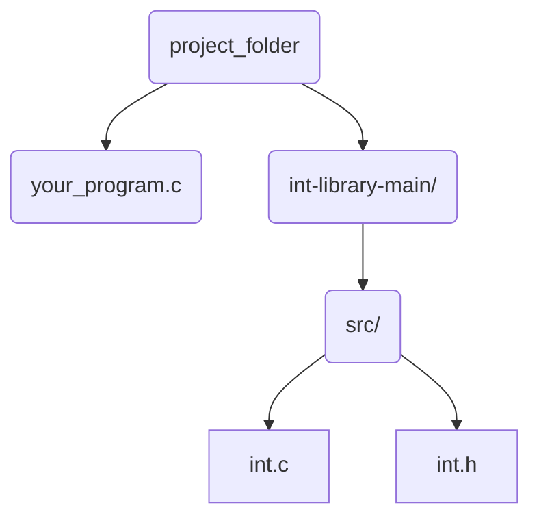

# int-library

This is a custom local library that lets you prompt a user for integer input in C.
<details>

<summary>What Does it Look Like?</summary>

### 

Using this library, you can access the get_int function. Here's what it looks like in a program:

```c
   #include "int.h"
   #include <stdio.h>

   int main()
   {
      int n = get_int("Type an integer: ");
      printf("Your integer is: %i\n", n);
   }
```

Output:
```bash
   $ ./your_program
   $ Type an integer: 2
     Your integer is: 2
```

</details>

# Usage
1. On this GitHub page, click the "Code" button and select "Download ZIP"
2. Unzip the downloaded folder
3. Move int-library into the same directory your C file is in
   


4. In your project folder, open a terminal and run the following:
```ruby
clang -I int-library/src -o your_program your_program.c int-library/src/int.c
```
   
5. All set! Now you can run you program
```ruby
./your_program
```
   
