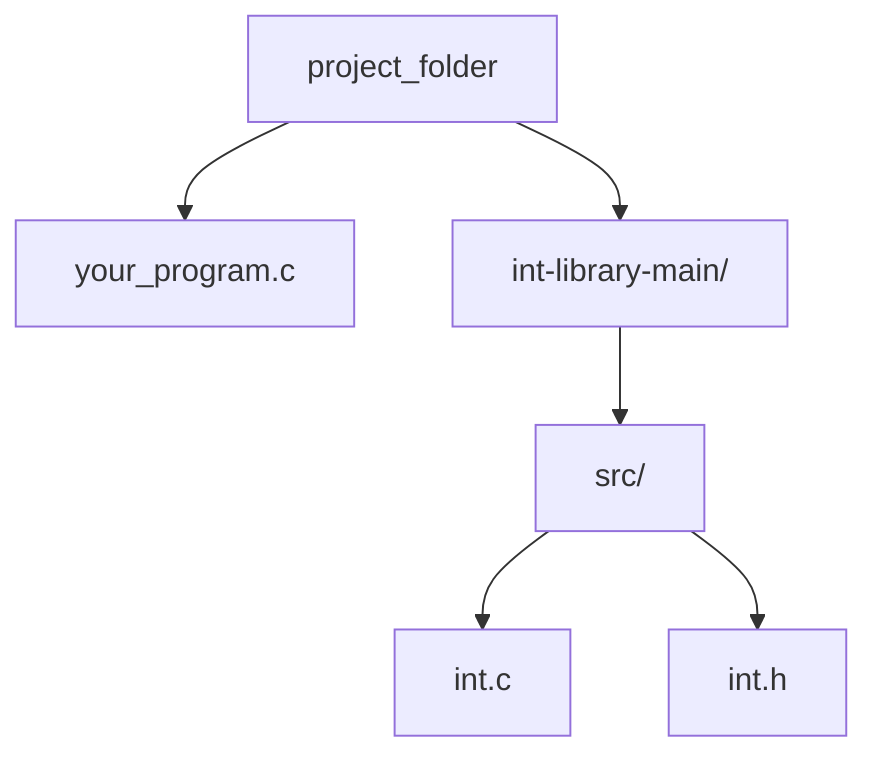

# int-library
<details>

<summary>Tips for collapsed sections</summary>

### You can add a header

You can add text within a collapsed section.

You can add an image or a code block, too.

```ruby
   puts "Hello World"
```

</details>
This is a custom local library that lets you prompt a user for integer input in C.

# Usage
1. On this GitHub page, click the "Code" button and select "Download ZIP"
2. Unzip the downloaded folder
3. Move int-library into the same directory your C file is in
   
## Example:


4. In your project folder, open a terminal and run the following:
```ruby
clang -I int-library/src -o your_program your_program.c int-library/src/int.c
```
   
5. All set! Now you can run you program
```ruby
./your_program
```
   
