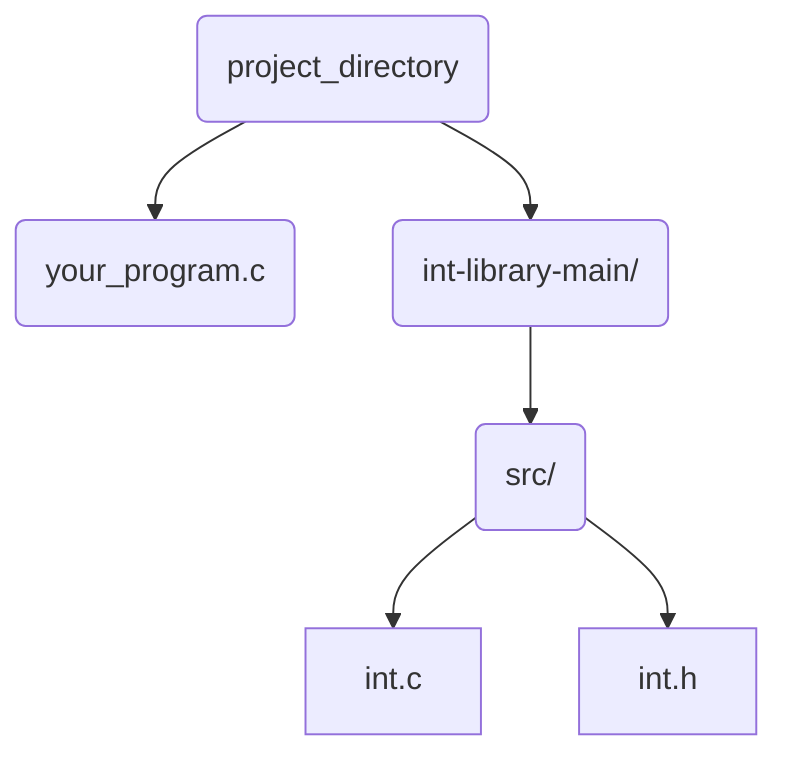

# int-library

This is a custom local library that contains the function ```get_int```, which allows you to prompt a user for integer input in C.
<details>

<summary>Example of get_int in C</summary>

### Ex: Prompt User to Type an Integer

```c
   #include "int.h"
   #include <stdio.h>

   int main()
   {
      int n = get_int("Type an integer: ");
      printf("Your integer is: %i\n", n);
   }
```

Output:
```bash
   $ ./your_program
   $ Type an integer: 2
     Your integer is: 2
```

</details>

<details>
<summary>Key Features of get_int</summary>

###
- Rejects invalid integer input (e.g strings)
- Reprompts user until there's a valid integer input

Examples of what ```get_int``` doesn't accept:
``` bash
   $ Type an integer: abc23           # Involving alphabetical characters
   $ Type an integer: 12bre
   $ Type an integer: Hello
   $ Type an integer:                 # Nothing inputted
   $ Type an integer: 2 4             # Separated integers
```
</details>

# Usage
1. On this GitHub page, click the "Code" button and select "Download ZIP"

2. Unzip the downloaded library folder ```int-library-main```
   
3. Move ```int-library-main``` into the same directory your C file is in
   


4. In your project folder, open a terminal and run the following:
```bash
clang -I int-library-main/src -o your_program your_program.c int-library-main/src/int.c
```
   
5. All set! Now you can run your program
```bash
./your_program
```
   
